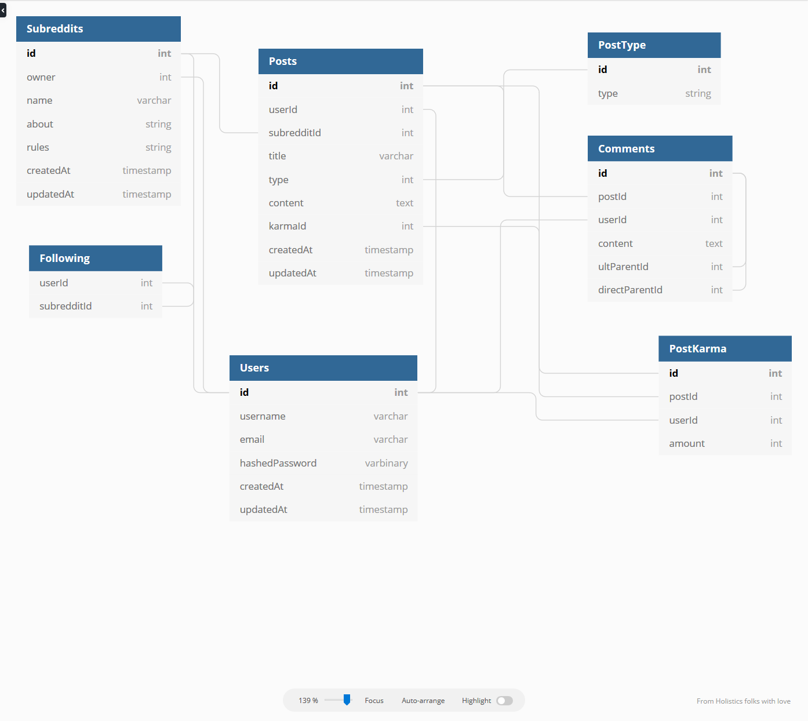

# Reddit Clone

## MVPs (in order of completion)
1. Subreddit CRUD
2. Post CRUD
3. Comments on Posts
4. Upvote / Downvote -> Karma
5. Following subreddits
6. Nested Comments

### Strech Goals
1. Comment Karma
2. Subreddit moderators
3. Saved Posts

---
## Database Design

---

## Routes
---
### Backend
---
### User
| Route                          | Methods                 | Purpose |
| ------------------------------ | ------------------------| ------- |
| /api/register                  | POST                    | User account creation |
| /api/user/:id                  | GET, PUT, DELETE        | Get, edit, or delete User account information |
| /api/user/:id/post             | GET                     | Get posts associated with the User |
| /api/user/:id/comments         | GET                     | Get comments associated with the User |

/api/user/:id/subreddit/:subredditId - post/delete

### Subreddit
| Route                                | Methods                 | Purpose |
| -----------------------------------  | ------------------------| ------- |
| /api/subreddit/create                | POST                    | creating subreddits |
| /api/subreddit/all                   | GET                     | returns all subreddits |
| /api/subreddit/:subredditId          | GET, PUT, DELETE        | subreddit retrieval. edit / delete if owner |
| /api/subreddits/:subredditId/post/   | GET                     | what was this for again? |
| /api/post/:postId                    | GET, POST, PUT, DELETE  | CRUD Posts |
| /api/post/:postId/karma/             | GET, POST               | Upvote and downvote |

---
### Frontend
---
| Route                                | Methods                 | Purpose |
| -----------------------------------  | ------------------------| ------- |
| /                                    | GET                     | display top posts from subreddits you follow |
| /login                               | POST                    | Login Functionality |
| /register                            | POST                    | User creation form |
| /r/:subreddit                        | GET                     | Subreddit view page |
| /r/:subreddit/posts/:postId          | GET                     | Viewing a post within a subreddit |
| /subreddits/create                   | GET, POST               | Form for creating a subreddit |
| /posts/create                        | GET, POST               | Form for creating a post |
| /u/user/:user                        | GET, PUT, DELETE        | User profile page |
| /u/user/:user/comments               | GET                     | User comments |
